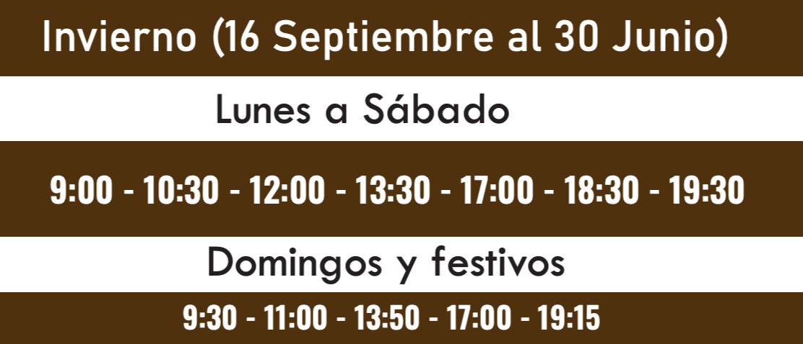
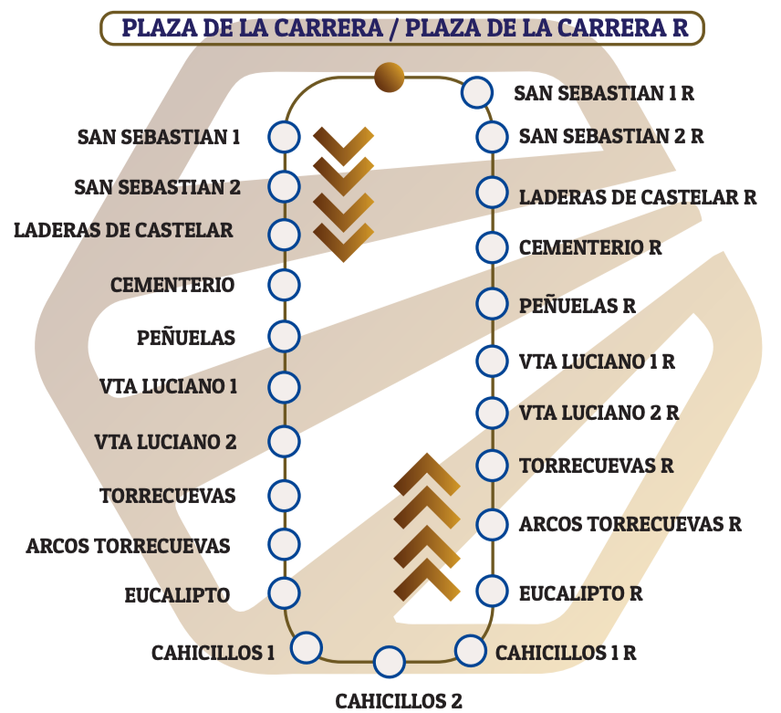

# almunecar-gtfs

Source-backed GTFS Schedule data for the Almuñécar urban bus network — built so
that every fact in it can be traced back to who said it, when, and why we
believed them.

> **Unofficial.** Not published by, endorsed by, or affiliated with Autocares
> Urbanos Almuñécar / Grupo Fajardo. Nothing here may be presented as an official
> operator feed unless and until the operator authorises it. See
> [`docs/google-transit-submission.md`](docs/google-transit-submission.md).

---

## Status at a glance

| | |
|---|---|
| Research | ✅ complete for the operator's whole published network |
| Canonical dataset | ✅ 74 stops, 7 routes, 6 patterns, 116 trips, 5 shapes |
| Provenance | ✅ 433 observations across 12 registered sources |
| QA invariants | ✅ 0 errors, 24 warnings |
| Tests / CI | ✅ 87 tests, green |
| **GTFS feed** | ❌ **cannot be built — see The Blocker** |
| Google Transit ready | ❌ blocked, and needs operator authorisation |
| Last source verification | **2026-08-10** |

---

## The Blocker

**No source publishes a time at any intermediate stop, so no feed can be built.**

Every operator page says the same thing:

> *"LOS HORARIOS INDICAN LA HORA DE SALIDA DESDE LA PARADA PRINCIPAL"*
> — the timetables give the departure from the principal stop.

GTFS needs a time at *every* stop. It is perfectly happy for the middle of a trip
to be estimated, as long as `timepoint=0` says so — but `arrival_time` and
`departure_time` are **required** at the first and last stop, and an estimate
there is not a marked approximation, it is the feed asserting when the service
starts and finishes.

So the rule this project enforces in code, not just in prose:

| Position in trip | GTFS | What we allow |
|---|---|---|
| First stop | times **required** | must be `published` |
| Intermediate | `timepoint=0` marks an approximation | may be estimated, if it says so |
| Last stop | times **required** | must be `published` |

`Pattern.has_anchored_endpoints` requires published times at both ends,
`is_publishable` requires it, and the builder drops any pattern that fails.
Every pattern currently fails, so `almunecar-gtfs build` refuses rather than
shipping invented precision.

**The good news: every line is a circular** that starts and ends at Plaza de la
Carrera. That collapses the problem to a single missing number per pattern — the
loop running time. With it, intermediate offsets follow by distance-proportional
allocation along the shape, marked `timepoint=0`. Ranked ways to get it are in
[`docs/methodology.md`](docs/methodology.md); the two realistic ones are **asking
the operator** and **recording a few runs and taking medians** (never a single
run — one bus stuck behind a delivery van is not a timetable).

---

## The network

Seven routes as the operator publishes them. `patterns` are distinct ordered stop
sequences; `trips` are scheduled departures reconstructed from the timetables.

| Line | Name | Patterns | Trips | Publishable | Why not |
|---|---|---:|---:|---|---|
| 1 | Circular | 1 | 41 | ❌ | roadworks diversion not in geometry; no timings |
| 2A | Almuñécar – La Herradura | 1 | 6 | ❌ | no intermediate timings |
| 2B | Almuñécar – La Herradura – Punta de la Mona | 2 | 27 | ❌ | no intermediate timings |
| 3A | Velilla – Taramay | 1 | 17 | ❌ | no intermediate timings |
| 3B | Velilla *(summer only)* | 0 | 0 | ❌ | no stop sequence in any machine-readable source |
| 3C | Taramay *(summer only)* | 0 | 0 | ❌ | no stop sequence in any machine-readable source |
| 4 / 5 | Torrecuevas | 1 | 25 | ❌ | **line number disputed** (blocking conflict) |

### Patterns

| Pattern | Season | Stops | Shape | Notes |
|---|---|---:|---|---|
| `ALM_1_CIRC` | all year | 19 | 6.3 km | |
| `ALM_2A_CIRC` | all year | 20 | 15.4 km | |
| `ALM_2B_CIRC_SUMMER` | summer | 24 | 20.2 km | serves Marina del Este |
| `ALM_2B_CIRC_WINTER` | winter | 23 | — | omits Marina del Este; **no shape yet** |
| `ALM_3A_CIRC` | all year | 22 | 10.7 km | |
| `ALM_TORRECUEVAS_CIRC` | all year | 17 | 9.0 km | order fixed from the operator's diagram |

### Seasons

The operator runs two periods, and this dataset models only the ones currently
published — future seasons are **not** assumed to repeat:

* **Summer** 1 July – 15 September 2026
* **Winter** 16 September 2026 – 30 June 2027

Ten service periods across those two seasons (Mon–Fri, Mon–Sat, Sat,
Sun/holidays, plus the 2B `_PUERTO` variants).

---

## Where the data comes from

### Operator — [urbanosalmunecar.es](https://urbanosalmunecar.es/)

Top of the hierarchy for route names, service periods and departures.
Contact: `urbanos@grupofajardo.es`, +34 958 88 27 62.

| Source id | Page |
|---|---|
| `official_index` | [Líneas urbanas](https://urbanosalmunecar.es/lineas-urbanas-almunecar/) |
| `official_l1_summer` | [Línea 1 Circular verano](https://urbanosalmunecar.es/lineas-urbanas-almunecar/circular-verano/) |
| `official_l1_winter` | [Línea 1 Circular invierno](https://urbanosalmunecar.es/lineas-urbanas-almunecar/almunecar-circular-linea-1-invierno/) |
| `official_l2_summer` | [Línea 2 La Herradura verano](https://urbanosalmunecar.es/lineas-urbanas-almunecar/la-herradura-verano/) |
| `official_l2_winter` | [Línea 2 La Herradura invierno](https://urbanosalmunecar.es/lineas-urbanas-almunecar/la-herradura-linea-2-invierno/) |
| `official_l3a_summer` | [Línea 3A Velilla–Taramay verano](https://urbanosalmunecar.es/lineas-urbanas-almunecar/velilla-taramay-verano/) |
| `official_l3a_winter` | [Línea 3A Velilla–Taramay invierno](https://urbanosalmunecar.es/lineas-urbanas-almunecar/velilla-taramay-invierno/) |
| `official_l3b_summer` | [Línea 3B Velilla verano](https://urbanosalmunecar.es/lineas-urbanas-almunecar/velilla-verano/) |
| `official_l3c_summer` | [Línea 3C Taramay verano](https://urbanosalmunecar.es/lineas-urbanas-almunecar/taramay-verano/) |
| `official_torrecuevas_summer` | [Torrecuevas verano](https://urbanosalmunecar.es/lineas-urbanas-almunecar/torrecuevas-verano/) |
| `official_torrecuevas_winter` | [Línea 5 Torrecuevas invierno](https://urbanosalmunecar.es/lineas-urbanas-almunecar/torrecuevas-linea-5-invierno/) |

### OpenStreetMap — `osm_route_relations`

Stop coordinates, ordered stop sequences and route geometry, via
[Overpass](https://overpass-api.de/api/interpreter). © OpenStreetMap
contributors, ODbL. The extract is committed at `data/evidence/osm/relations.json`
so ingestion is reproducible offline.

| Relation | Line |
|---|---|
| [11185550](https://www.openstreetmap.org/relation/11185550) | Bus 1: Circular |
| [18501805](https://www.openstreetmap.org/relation/18501805) | Línea 2A |
| [18496909](https://www.openstreetmap.org/relation/18496909) | Línea 2B |
| [11186061](https://www.openstreetmap.org/relation/11186061) | Bus 3: Velilla–Taramay |
| [18501914](https://www.openstreetmap.org/relation/18501914) | Línea 5 Torrecuevas |

### Moovit — QA reference only

Four routes transcribed for discrepancy detection. **Never** authoritative
against the operator, and never copied into the canonical dataset. See
[`docs/comparison.md`](docs/comparison.md).

### Looked for and not found

* **iBusGPS.** No public endpoint is reachable from the operator's site,
  grupofajardo.es, or the open web (checked 2026-08-10). Realtime work has
  nothing to attach to.
* **Ayuntamiento de Almuñécar.** No municipal timetable or GIS document located.
  The `municipal` tier of the hierarchy is currently empty.

---

## Why this was hard: the timetables are pictures

The operator publishes **every** timetable and route diagram as an image. There is
no markup to parse, no PDF to extract, no API. Each of the 22 transcribed
timetables was read off a picture by hand and records the exact image URL it came
from.

All 21 images are mirrored in [`data/evidence/images/`](data/evidence/images/)
with a manifest (`data/evidence/images.yaml`) giving each one's SHA-256, source
page and upload URL — so the transcription can be checked against what it was read
from. `almunecar-gtfs check` fails if an image no longer matches its hash.

**This is the entire winter timetable for Torrecuevas.** Everything the dataset
knows about when that line runs comes from reading this picture:



**And this is the stop sequence.** Note the `R` suffixes — the operator itself
treats the two directions as different stops, which is why this dataset keeps
opposite sides of a road as separate `stop_id`s. It lists 25 calls; OpenStreetMap
has nodes for only 17:



---

## Challenges, and what came out of them

**The Torrecuevas stop order was wrong in OpenStreetMap.** OSM listed Cortijo
Cahicillos — the far apex of the line — between two stops beside the town. A
proximity check can never catch this: every stop really *is* on the route, only
the order is wrong. So `qa.check_stop_order` walks the shape forward one stop at a
time and asks what honouring the given order costs. It measured the contradiction
exactly: **3,471 m** for Cortijo Cahicillos and **2,432 m** for Torrecuevas,
against stops that sit within 10 m of the route. Fixed from the operator's own
diagram, then [fixed upstream in
OSM](https://www.openstreetmap.org/changeset/187244187).

**Line 2B and the port turned out to be a season, not an exception.** The 2B
diagram marks `MARINA DEL ESTE*` and the winter page footnotes it: *"Esta parada
no se realiza en el horario de invierno."* So it is a seasonal pattern difference
— not an operational exception and not a realtime alert. `ALM_2B_CIRC_WINTER`
omits that stop.

**A POI is not a bus stop.** A hotel called *Playa Velilla* is not the stop called
*Playa Velilla*. Any observation tagged `evidence_kind: poi` is disqualified from
establishing a stop coordinate, and is rescued only if a *different* source
independently places the stop within 30 m — at reduced confidence.

**Stale pages outrank nothing.** Sources carry `authoritative_until`, and a page
known to be superseded loses to a current one, so an old route number can never
win by default.

---

## Open questions

1. **How long does each loop take?** The blocker. One number per line unblocks the
   whole feed. → drafted email to the operator; or record runs.
2. **Torrecuevas: line 4 or line 5?** The summer page body says `LINEA 4`; the
   winter page title *and URL slug* say `Línea 5`; OSM and Moovit say 5. Both
   operator pages carry the **same** sitemap `lastmod` (2026-05-14), so neither is
   simply the older one — and the summer page is demonstrably careless, its own
   validity line reading *"horario de **invierno** desde el 1 julio"*. Recorded as
   a blocking conflict. **Known weakness:** `routes.yaml` currently shows
   `route_short_name: "4"`, which is not a decision — it is an alphabetical
   tiebreak on `source_id` between two equally-ranked claims. The route is held out
   of the feed by the blocking conflict, so nothing consumes it, but the value
   looks more settled than it is.
3. **Which 2B departures actually descend to the port?** The summer image splits
   into an unmarked row (10:30, 12:30, 16:30, 20:30, 21:30) and a `* BAJADA PUERTO`
   row (8:45, 14:00, 17:30, 19:00). Which is which is stated nowhere.
4. **What are the stops on 3B and 3C?** Neither is mapped. The operator's diagrams
   name 37 and 11 calls respectively; almost none have coordinates anywhere.
5. **Is 3B's weekday service exactly half-hourly?** Published as a frequency —
   *"cada 30 min desde las 8:30 hasta 14:30 y desde 17:00 hasta 0:30"*. Expanding
   that into departures is an interpretation, so it is kept as prose rather than
   presented as published times.
6. **Where is the Cabria stop?** From 17 July to 15 September, 3B extends to a new
   stop at the Avda. Pintor Domínguez de Haro roundabout. The operator links a map
   pin at `36.746471, -3.652865`, which sits noticeably inland of the beach it
   claims to serve. Needs checking.
7. **What routing does the Line 1 diversion actually use?** Since 13 April 2026 the
   Paseo del Altillo is closed for roadworks (~10 months) and the urban lines
   divert via calle Guadix. No geometry available; line 1 is held back.
8. **Which days are public holidays?** Sunday and holiday timetables are shared,
   but the operator never publishes the holiday calendar. Not modelled.
9. **`ALM_2B_CIRC_WINTER` has no shape.** Derived by removing one stop from the
   summer pattern; the corresponding geometry has not been cut.
10. **Does iBusGPS exist publicly at all?** If so it would supply realtime *and* the
    loop times. Nothing found.

---

## Contributions made upstream

| Date | What | Where |
|---|---|---|
| 2026-08-10 | Reordered the Línea 5 Torrecuevas platform members into travel order | [changeset 187244187](https://www.openstreetmap.org/changeset/187244187) |

Prepared but **not** applied, because it would require inventing data: the eight
stops the operator names and OSM lacks — `CEMENTERIO`, `EUCALIPTO`,
`CAHICILLOS 2`, `VTA LUCIANO 2` and their returns. No source gives a position for
any of them. They need a survey, not a guess. See [`osm/README.md`](osm/README.md).

---

## Cross-checks

Independent descriptions of the same network, compared to catch our own mistakes.
Full detail in [`docs/comparison.md`](docs/comparison.md).

| Pattern | vs Moovit | vs operator diagram |
|---|---|---|
| `ALM_1_CIRC` | 19 / 21 | 19 / 22 |
| `ALM_2A_CIRC` | — | 20 / 22 |
| `ALM_2B_CIRC_SUMMER` | 24 / 23 | 24 / 29 |
| `ALM_3A_CIRC` | 22 / 22 ✅ | 22 / 26 |
| `ALM_TORRECUEVAS_CIRC` | 17 / 17 ✅ | 17 / 25 |

The pattern is consistent: **OSM is systematically thinner than the operator's own
diagrams.** Moovit is thinner too, and additionally a season out of date — it
served the operator's *winter* hours for line 2 while summer was running, and
still routes line 1 through the closed Paseo del Altillo.

---

## How it works

Two questions, kept apart permanently, because the second will be revised and the
first must survive that:

1. **What do the sources say?** → `data/evidence/`
2. **What do we believe the network is?** → `data/canonical/`

```
sources              reconciliation          canonical              GTFS
 operator   ─┐                            ┌─ stops.geojson  ─┐
 municipal  ─┤   observations.csv         ├─ routes.yaml     ├─ data/generated/
 iBusGPS    ─┼──▶ conflicts.yaml    ─────▶┼─ patterns.yaml   ┼─▶ almunecar-gtfs.zip
 Moovit     ─┤   stop_registry.yaml       ├─ schedules.yaml  ┤
 OSM        ─┘   images.yaml              └─ shapes.geojson ─┘
```

Scrapers may only write observations. Only `reconcile/` may write canonical data.
Canonical files are generated but **committed**, so every change in what we believe
shows up as a reviewable diff — and CI re-runs reconciliation and fails if the
committed data does not reproduce.

Evidence is weighed **per field**, not by picking one global winner:

| Field family | Hierarchy (best first) |
|---|---|
| Route names, service periods, departures | operator → municipal → iBusGPS → Moovit → OSM → derived |
| Stop coordinates | explicit operator/iBusGPS platform coordinate → official map pin → municipal GIS → verified OSM `highway=bus_stop` → field → Moovit → OSM → manual research |
| Route geometry | operator/iBusGPS or vehicle traces → municipal → OSM roads → reconstruction |

Hierarchy beats confidence on purpose: a medium-confidence operator page outranks
a confirmed Moovit page, because the operator is the authority on its own network
and Moovit is a third party reading the same signs we are.

Full detail: [`docs/methodology.md`](docs/methodology.md).

---

## Usage

```bash
uv sync
```

```bash
uv run almunecar-gtfs ingest --offline
```

```bash
uv run almunecar-gtfs reconcile
```

```bash
uv run almunecar-gtfs check
```

| Command | Does |
|---|---|
| `ingest [--offline] [--refresh]` | rebuild `data/evidence` from sources and transcriptions |
| `reconcile` | evidence → `data/canonical` + `conflicts.yaml` |
| `check [--strict]` | QA invariants over the canonical dataset |
| `build` | canonical → `data/generated/gtfs` + zip *(currently refuses — see The Blocker)* |
| `validate [--validator-jar]` | MobilityData canonical GTFS validator |
| `map` | interactive QA map at `qa/map.html` |
| `conflicts` | `docs/conflicts.md` |
| `compare` | `docs/comparison.md` |
| `monitor` | re-fetch sources, report content changes |

The QA map is the fastest way in: click any stop and it shows every coordinate
claim, ranked, which one won, from which source, at what confidence, with what
flags. Click `ALM_0042` and you can see *why* it is there.

### Validating

The MobilityData validator jar is never downloaded automatically. Get one from
[its releases](https://github.com/MobilityData/gtfs-validator/releases), then:

```bash
GTFS_VALIDATOR_JAR=/path/to/gtfs-validator-cli.jar uv run almunecar-gtfs validate
```

CI fetches it explicitly, fails on any validator **error**, and keeps warnings as
an artifact. Release criterion is zero errors.

### Development

```bash
uv run pytest && uv run ruff check .
```

Both run on every push and pull request, alongside a check that `ingest` and
`reconcile` reproduce exactly what is committed.

---

## Repository layout

| Path | Contents |
|---|---|
| `data/evidence/` | What sources say: `sources.yaml`, `observations.csv`, `conflicts.yaml`, `stop_registry.yaml`, `images/`, `images.yaml`, `geometry/`, `osm/` |
| `data/canonical/` | What we believe: generated by `reconcile`, committed for reviewability |
| `data/generated/` | GTFS output (git-ignored, rebuilt deterministically) |
| `data/publication.yaml` | Human-owned: authorisation status, publisher identity, `feed_buildable` |
| `src/almunecar_gtfs/sources/` | Acquisition. Writes observations only |
| `src/almunecar_gtfs/reconcile/` | The only code allowed to produce canonical data |
| `src/almunecar_gtfs/gtfs/` | Deterministic generation + validator wrapper |
| `src/almunecar_gtfs/qa.py` | Invariants, shared by CLI, CI and tests |
| `osm/` | Prepared OpenStreetMap fixes and an upload tool |
| `docs/` | Methodology, sources, conflicts, comparison, Google Transit handoff |

---

## Licensing and attribution

Code and transit data are separate questions.

**Code** (`src/`, `tests/`, `osm/`) is covered by this repository's licence.

**Operator material.** The timetable and route-diagram images in
`data/evidence/images/` are the work of Autocares Urbanos Almuñécar / Grupo
Fajardo and remain theirs, reproduced unmodified with attribution and source links
for verification and archive. No ownership is claimed and no licence granted. If
the operator would prefer they were not mirrored here, open an issue — they will
be removed, and no transit data is lost, because the *facts* read from them are
not copyrightable and are what the dataset is built on.

**OpenStreetMap** data — stop coordinates, stop sequences, route geometry — is
© OpenStreetMap contributors, licensed ODbL.

**Republication rights for the compiled dataset are not yet established.** That is
the open question behind `data/publication.yaml`, which reads
`authorized_by_operator: false` and will keep every artifact labelled unofficial
until it does not.

---

## Helping

The single most useful thing: **ride each line once with a GPS recorder** and note
how long the loop takes. Three runs per line beats one, because a median survives
a bus stuck behind a delivery van. That unblocks the feed.

After that: survey the eight missing Torrecuevas stops, and the 3B/3C stops that
are on no map at all.
